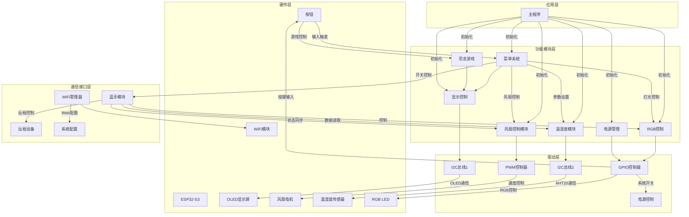

# AbenFan

## 项目架构



## 烧录命令

```shell
esptool.py --chip esp32s3 merge_bin -o .pio/build/esp32-s3-devkitc-1/flash.bin --flash_mode dio --flash_size 16MB 0x1000 .pio/build/esp32-s3-devkitc-1/bootloader.bin 0x8000 .pio/build/esp32-s3-devkitc-1/partitions.bin 0x10000 .pio/build/esp32-s3-devkitc-1/firmware.bin

esptool.py --chip esp32s3 merge_bin -o .pio/build/esp32-s3-devkitc-1/flash.bin --flash_mode dio --flash_size 16MB 0x1000 .pio/build/esp32-s3-devkitc-1/bootloader.bin 0x8000 .pio/build/esp32-s3-devkitc-1/partitions.bin 0x10000 .pio/build/esp32-s3-devkitc-1/firmware.bin 0xC90000 .pio/build/esp32-s3-devkitc-1/spiffs.bin

esptool.py --chip esp32s3 --after hard_reset write_flash -z --flash_mode dio --flash_freq 40m --flash_size 16MB 0x0 .pio/build/esp32-s3-devkitc-1/flash.bin
```
